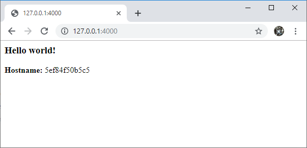

# Docker

Here are a couple of commands to install Docker Community Edition (CE) on Centos 7.

> **Table of contents**
> 
> * [1. Install Docker CE](#1.-Install-Docker-CE)
>   * [1.1 Repository update](#1.1-Repository-update)
>   * [1.2 Docker installation command](#1.2-Docker-installation-command)
> * [2. Uninstall Docker CE](#2.-Uninstall-Docker-CE)
> * [3. Testing Docker is running](#3.-Testing-Docker-is-running)
> * [4. Usefull commands](#4.-Usefull-commands)
>   * [4.1 Get Docker currently installed version](#4.1-Get-Docker-currently-installed-version)
>   * [4.2 Get Docker information (number of images, containers, etc.)](#4.2-Get-Docker-information-(number-of-images,-containers,-etc.))
>   * [4.3 List images](#4.3-List-images)
>   * [4.4 List containers](#4.4-List-containers)
>   * [4.5 Checking running containers](#4.5-Checking-running-containers)
>   * [4.6 Import a Docker image](#4.6-Import-a-Docker-image)
>   * [4.7 Delete a container](#4.7-Delete-a-container)
>   * [4.8 Delete an image](#4.8-Delete-an-image)
> * [5. Running a container](#5.-Running-a-container)
>   * [5.1 Running and exiting immediately](#5.1-Running-and-exiting-immediately)
>   * [5.2 Running and keep it running](#5.2-Running-and-keep-it-running)
>   * [5.3 Running and deleting immediately the container](#5.3-Running-and-deleting-immediately-the-container)
> * [6. Creating a Docker image](#6.-Creating-a-Docker-image)
>   * [Step 1: Creation of the working folder](#Step-1:-Creation-of-the-working-folder)
>   * [Step 2: Creation of the python script](#Step-2:-Creation-of-the-python-script)
>   * [Step 3: Creation of the python external python libraries](#Step-3:-Creation-of-the-python-external-python-libraries)
>   * [Step 4: Creation of the container definition file](#Step-4:-Creation-of-the-container-definition-file)
>   * [Step 5: Building the image](#Step-5:-Building-the-image)
>   * [Step 6: Running the image](#Step-6:-Running-the-image)
>   * [test](#test)


## 1. Install Docker CE

### 1.1 Repository update

2 commands to use to update the repository first.

>  sudo yum install -y yum-utils device-mapper-persistent-data lvm2

``` shell
[root@centos7 ~]# yum install -y yum-utils device-mapper-persistent-data lvm2
Modules complémentaires chargés : fastestmirror, langpacks
Loading mirror speeds from cached hostfile
 * base: mirrors.ircam.fr
 * extras: mirrors.ircam.fr
 * updates: mirrors.ircam.fr
Le paquet yum-utils-1.1.31-50.el7.noarch est déjà installé dans sa dernière version
Le paquet device-mapper-persistent-data-0.7.3-3.el7.x86_64 est déjà installé dans sa dernière version
Le paquet 7:lvm2-2.02.180-10.el7_6.7.x86_64 est déjà installé dans sa dernière version
Rien à faire
[root@centos7 ~]#
```

> sudo yum-config-manager --add-repo https://download.docker.com/linux/centos/docker-ce.repo


``` shell
[root@centos7 ~]# yum-config-manager --add-repo https://download.docker.com/linux/centos/docker-ce.repo
Modules complémentaires chargés : fastestmirror, langpacks
adding repo from: https://download.docker.com/linux/centos/docker-ce.repo
grabbing file https://download.docker.com/linux/centos/docker-ce.repo to /etc/yum.repos.d/docker-ce.repo
repo saved to /etc/yum.repos.d/docker-ce.repo
[root@centos7 ~]#
```

### 1.2 Docker installation command

Here is the installation command to have Docer working on the Linux host.

> sudo yum install docker-ce docker-ce-cli containerd.io

``` shell
[root@centos7 ~]# sudo yum install docker-ce docker-ce-cli containerd.io
Modules complémentaires chargés : fastestmirror, langpacks
Loading mirror speeds from cached hostfile
 * base: mirrors.ircam.fr
 * extras: mirrors.ircam.fr
 * updates: mirrors.ircam.fr
Le paquet 1:docker-ce-cli-18.09.6-3.el7.x86_64 est déjà installé dans sa dernière version
Le paquet containerd.io-1.2.5-3.1.el7.x86_64 est déjà installé dans sa dernière version
Résolution des dépendances
--> Lancement de la transaction de test
---> Le paquet docker-ce.x86_64 3:18.09.6-3.el7 sera installé
--> Résolution des dépendances terminée

Dépendances résolues

========================================================================================================================
 Package                  Architecture          Version                           Dépôt                           Taille
========================================================================================================================
Installation :
 docker-ce                x86_64                3:18.09.6-3.el7                   docker-ce-stable                 19 M

Résumé de la transaction
========================================================================================================================
Installation   1 Paquet

Taille totale des téléchargements : 19 M
Taille d'installation : 81 M
Is this ok [y/d/N]: y
Downloading packages:
docker-ce-18.09.6-3.el7.x86_64.rpm                                                               |  19 MB  00:00:02
Running transaction check
Running transaction test
Transaction test succeeded
Running transaction
  Installation : 3:docker-ce-18.09.6-3.el7.x86_64                                                                   1/1
  Vérification : 3:docker-ce-18.09.6-3.el7.x86_64                                                                   1/1

Installé :
  docker-ce.x86_64 3:18.09.6-3.el7

Terminé !
[root@centos7 ~]#
```

## 2. Uninstall Docker CE

If needed Docker can be uninstalled. Removing forgotten images/containers might be done alos (not described here).

> yum remove docker-ce

``` shell
[root@centos7 ~]# yum remove docker-ce
Modules complémentaires chargés : fastestmirror, langpacks
Résolution des dépendances
--> Lancement de la transaction de test
---> Le paquet docker-ce.x86_64 3:18.09.6-3.el7 sera effacé
--> Résolution des dépendances terminée
base/7/x86_64                                                                                    | 3.6 kB  00:00:00
docker-ce-stable/x86_64                                                                          | 3.5 kB  00:00:00
extras/7/x86_64                                                                                  | 3.4 kB  00:00:00
updates/7/x86_64                                                                                 | 3.4 kB  00:00:00

Dépendances résolues

========================================================================================================================
 Package                  Architecture          Version                          Dépôt                            Taille
========================================================================================================================
Suppression :
 docker-ce                x86_64                3:18.09.6-3.el7                  @docker-ce-stable                 81 M

Résumé de la transaction
========================================================================================================================
Supprimer  1 Paquet

Taille d'installation : 81 M
Est-ce correct [o/N] : o
Downloading packages:
Running transaction check
Running transaction test
Transaction test succeeded
Running transaction
/usr/bin/dockerd n'a pas encore été configuré en tant qu'alternative à dockerd
  Suppression  : 3:docker-ce-18.09.6-3.el7.x86_64                                                                   1/1
  Vérification : 3:docker-ce-18.09.6-3.el7.x86_64                                                                   1/1

Supprimé :
  docker-ce.x86_64 3:18.09.6-3.el7

Terminé !
[root@centos7 ~]#
```

## 3. Testing Docker is running

Let's check if the service is running.

> systemctl status docker

``` shell
[root@centos7 ~]# systemctl status docker
? docker.service - Docker Application Container Engine
   Loaded: loaded (/usr/lib/systemd/system/docker.service; disabled; vendor preset: disabled)
   Active: inactive (dead)
     Docs: https://docs.docker.com

juin 09 07:02:48 centos7 dockerd[3315]: time="2019-06-09T07:02:48.554055018+02:00" level=info msg="Loading conta...art."
juin 09 07:03:05 centos7 dockerd[3315]: time="2019-06-09T07:03:05.767508668+02:00" level=info msg="Default bridg...ress"
juin 09 07:03:07 centos7 dockerd[3315]: time="2019-06-09T07:03:07.658506716+02:00" level=info msg="Loading conta...one."
juin 09 07:03:08 centos7 dockerd[3315]: time="2019-06-09T07:03:08.572303542+02:00" level=info msg="Docker daemon....09.6
juin 09 07:03:08 centos7 dockerd[3315]: time="2019-06-09T07:03:08.572588513+02:00" level=info msg="Daemon has co...tion"
juin 09 07:03:08 centos7 systemd[1]: Started Docker Application Container Engine.
juin 09 07:03:08 centos7 dockerd[3315]: time="2019-06-09T07:03:08.928673786+02:00" level=info msg="API listen on...sock"
juin 09 11:00:42 centos7 systemd[1]: Stopping Docker Application Container Engine...
juin 09 11:00:42 centos7 dockerd[3315]: time="2019-06-09T11:00:42.909296195+02:00" level=info msg="Processing si...ted'"
juin 09 11:00:42 centos7 systemd[1]: Stopped Docker Application Container Engine.
Hint: Some lines were ellipsized, use -l to show in full.
[root@centos7 ~]#
```

-> By default Docker deamon is not running.

Let's make it run.

> systemctl start docker

``` shell
[root@centos7 ~]# systemctl start docker
[root@centos7 ~]# systemctl status docker
? docker.service - Docker Application Container Engine
   Loaded: loaded (/usr/lib/systemd/system/docker.service; disabled; vendor preset: disabled)
   Active: active (running) since dim. 2019-06-09 11:16:59 CEST; 4s ago
     Docs: https://docs.docker.com
 Main PID: 14421 (dockerd)
    Tasks: 12
   Memory: 33.1M
   CGroup: /system.slice/docker.service
           mq14421 /usr/bin/dockerd -H fd:// --containerd=/run/containerd/containerd.sock

juin 09 11:16:57 centos7 dockerd[14421]: time="2019-06-09T11:16:57.614024431+02:00" level=info msg="pickfirstBal...=grpc
juin 09 11:16:57 centos7 dockerd[14421]: time="2019-06-09T11:16:57.661662965+02:00" level=info msg="[graphdriver...lay2"
juin 09 11:16:57 centos7 dockerd[14421]: time="2019-06-09T11:16:57.673014729+02:00" level=info msg="Graph migrat...onds"
juin 09 11:16:57 centos7 dockerd[14421]: time="2019-06-09T11:16:57.674449115+02:00" level=info msg="Loading cont...art."
juin 09 11:16:58 centos7 dockerd[14421]: time="2019-06-09T11:16:58.666087357+02:00" level=info msg="Default brid...ress"
juin 09 11:16:58 centos7 dockerd[14421]: time="2019-06-09T11:16:58.960505346+02:00" level=info msg="Loading cont...one."
juin 09 11:16:58 centos7 dockerd[14421]: time="2019-06-09T11:16:58.995057112+02:00" level=info msg="Docker daemo....09.6
juin 09 11:16:58 centos7 dockerd[14421]: time="2019-06-09T11:16:58.995247867+02:00" level=info msg="Daemon has c...tion"
juin 09 11:16:59 centos7 dockerd[14421]: time="2019-06-09T11:16:59.023290431+02:00" level=info msg="API listen o...sock"
juin 09 11:16:59 centos7 systemd[1]: Started Docker Application Container Engine.
Hint: Some lines were ellipsized, use -l to show in full.
[root@centos7 ~]#
```

A way to check that Docker is working is to run the "hello world" test. This test consists of downloading a simple Docker image then running Docker with this image.

> sudo docker run hello-world

``` shell
[root@centos7 ~]# sudo docker run hello-world
Unable to find image 'hello-world:latest' locally
latest: Pulling from library/hello-world
1b930d010525: Pull complete
Digest: sha256:0e11c388b664df8a27a901dce21eb89f11d8292f7fca1b3e3c4321bf7897bffe
Status: Downloaded newer image for hello-world:latest

Hello from Docker!
This message shows that your installation appears to be working correctly.

To generate this message, Docker took the following steps:
 1. The Docker client contacted the Docker daemon.
 2. The Docker daemon pulled the "hello-world" image from the Docker Hub.
    (amd64)
 3. The Docker daemon created a new container from that image which runs the
    executable that produces the output you are currently reading.
 4. The Docker daemon streamed that output to the Docker client, which sent it
    to your terminal.

To try something more ambitious, you can run an Ubuntu container with:
 $ docker run -it ubuntu bash

Share images, automate workflows, and more with a free Docker ID:
 https://hub.docker.com/

For more examples and ideas, visit:
 https://docs.docker.com/get-started/

[root@centos7 ~]#
```

Since the container did not exists the image of the container  has been downloaded. We can see it in the image list of Docker.

``` shell
[root@centos7 ~]# docker images
REPOSITORY          TAG                 IMAGE ID            CREATED             SIZE
hello-world         latest              fce289e99eb9        5 months ago        1.84kB
[root@centos7 ~]#
```

## 4. Usefull commands

### 4.1 Get Docker currently installed version

> docker --version

``` shell
[root@centos7 ~]# docker --version
Docker version 18.09.6, build 481bc77156
[root@centos7 ~]#
```

### 4.2 Get Docker information (number of images, containers, etc.)

> docker info

``` shell
[root@centos7 ~]# docker info
Containers: 1
 Running: 0
 Paused: 0
 Stopped: 1
Images: 1
Server Version: 18.09.6
Storage Driver: overlay2
 Backing Filesystem: xfs
 Supports d_type: true
 Native Overlay Diff: true
Logging Driver: json-file
Cgroup Driver: cgroupfs
Plugins:
 Volume: local
 Network: bridge host macvlan null overlay
 Log: awslogs fluentd gcplogs gelf journald json-file local logentries splunk syslog
Swarm: inactive
Runtimes: runc
Default Runtime: runc
Init Binary: docker-init
containerd version: bb71b10fd8f58240ca47fbb579b9d1028eea7c84
runc version: 2b18fe1d885ee5083ef9f0838fee39b62d653e30
init version: fec3683
Security Options:
 seccomp
  Profile: default
Kernel Version: 3.10.0-957.12.2.el7.x86_64
Operating System: CentOS Linux 7 (Core)
OSType: linux
Architecture: x86_64
CPUs: 1
Total Memory: 3.701GiB
Name: centos7
ID: VKLJ:6VVK:YXH5:5RUP:PTDJ:C4FB:T7MJ:6YEX:JDC4:2QUL:LDI3:2PXD
Docker Root Dir: /var/lib/docker
Debug Mode (client): false
Debug Mode (server): false
Registry: https://index.docker.io/v1/
Labels:
Experimental: false
Insecure Registries:
 127.0.0.0/8
Live Restore Enabled: false
Product License: Community Engine

[root@centos7 ~]#
```

### 4.3 List images

> docker images

or

> docker image ls


``` shell
[root@centos7 ~]# docker images
REPOSITORY          TAG                 IMAGE ID            CREATED             SIZE
hello-world         latest              fce289e99eb9        5 months ago        1.84kB
[root@centos7 ~]#
```

Images and containers are stored in:
> /var/lib/docker

Example with the hello world image:

``` shell
[root@centos7 ~]# find /var/lib/docker/ | grep hello
/var/lib/docker/overlay2/689d95fd8f27e625ca277256ae3e33a54b921d5d5fd7271a46bc1c45298bbfb2/diff/hello
[root@centos7 ~]#
```

### 4.4 List containers

> docker container ls

or (all containers including exited containers)

> docker container ls --all

``` shell
[root@centos7 ~]# docker container ls
CONTAINER ID        IMAGE               COMMAND             CREATED             STATUS              PORTS               NAMES
[root@centos7 ~]# docker container ls --all
CONTAINER ID        IMAGE               COMMAND             CREATED             STATUS                      PORTS               NAMES
bd64f9376534        hello-world         "/hello"            18 minutes ago      Exited (0) 18 minutes ago                       compassionate_rubin
[root@centos7 ~]#
```

### 4.5 Checking running containers

> docker ps -a

``` shell
[root@centos7 ~]# docker ps -a
CONTAINER ID        IMAGE               COMMAND             CREATED             STATUS              PORTS               NAMES
fcfd13a0d034        alpine              "/bin/sh"           2 minutes ago       Up 2 minutes                            frosty_albattani
[root@centos7 ~]#
```

### 4.6 Import a Docker image

An online image of the alpine linux distribution is download to Docker locally.

> docker pull alpine

``` shell
[root@centos7 ~]# docker pull alpine
Using default tag: latest
latest: Pulling from library/alpine
e7c96db7181b: Pull complete
Digest: sha256:769fddc7cc2f0a1c35abb2f91432e8beecf83916c421420e6a6da9f8975464b6
Status: Downloaded newer image for alpine:latest
[root@centos7 ~]# docker images
REPOSITORY          TAG                 IMAGE ID            CREATED             SIZE
alpine              latest              055936d39205        4 weeks ago         5.53MB
[root@centos7 ~]#
```

### 4.7 Delete a container

> docker container rm *container_id*

``` shell
[root@centos7 ~]# docker container ls -all
CONTAINER ID        IMAGE               COMMAND             CREATED             STATUS                      PORTS               NAMES
bd64f9376534        hello-world         "/hello"            42 minutes ago      Exited (0) 42 minutes ago                       compassionate_rubin
[root@centos7 ~]# docker container rm bd64f9376534
bd64f9376534
[root@centos7 ~]# docker container ls -all
CONTAINER ID        IMAGE               COMMAND             CREATED             STATUS              PORTS               NAMES
[root@centos7 ~]#
```

### 4.8 Delete an image

> docker image rm *image_id*

``` shell
[root@centos7 ~]# docker image ls
REPOSITORY          TAG                 IMAGE ID            CREATED             SIZE
hello-world         latest              fce289e99eb9        5 months ago        1.84kB
[root@centos7 ~]# docker image rm fce289e99eb9
Untagged: hello-world:latest
Untagged: hello-world@sha256:0e11c388b664df8a27a901dce21eb89f11d8292f7fca1b3e3c4321bf7897bffe
Deleted: sha256:fce289e99eb9bca977dae136fbe2a82b6b7d4c372474c9235adc1741675f587e
Deleted: sha256:af0b15c8625bb1938f1d7b17081031f649fd14e6b233688eea3c5483994a66a3
[root@centos7 ~]# docker image ls
REPOSITORY          TAG                 IMAGE ID            CREATED             SIZE
[root@centos7 ~]#
```

## 5. Running a container

 An image is used to create an container. A container is considered as an instance of the image.

There 3 ways to run a container from an image. For the purpose of this demonstration the alpine linux os will be used.

Important: when the container is created it is **staying** in the list of the active (docker container ls) or non-active (docker container ls --all) containers.

### 5.1 Running and exiting immediately

Please note that the container is existing but **stays** in the list of the container; it is not erased after creation even though the execution of the program is ended.

> docker run alpine echo hi everyone

``` shell
[root@centos7 ~]# docker run alpine echo hi everyone
hi everyone
[root@centos7 ~]# docker container ls -a
CONTAINER ID        IMAGE               COMMAND              CREATED             STATUS                      PORTS               NAMES
10d038897317        alpine              "echo hi everyone"   11 seconds ago      Exited (0) 10 seconds ago                       goofy_mirzakhani
[root@centos7 ~]#
```

### 5.2 Running and keep it running

The idea is to run a Docker container and using it then leaving the container. The container is then still running as a processus. Ctrl+P then Ctrl+Q is used to  let the container running in background.

Parameter -it allows container to run as an interactive process.

Please not that "docker container ls" is used and not "-all" version.

Later ont the command "docker container stop c983bea32e29" will be needed t stop the container.

> docker run -it alpine /bin/sh

``` shell
[root@centos7 ~]# docker run -it alpine /bin/sh
/ # echo hi everyone
hi everyone
/ # [root@centos7 ~]# docker container ls
CONTAINER ID        IMAGE               COMMAND             CREATED             STATUS              PORTS               NAMES
c983bea32e29        alpine              "/bin/sh"           24 seconds ago      Up 23 seconds                           musing_mclean
[root@centos7 ~]#
```

How about if we want to go back to the container?

Here is how to do it:

> docker attach *container_id*

``` shell
[root@centos7 ~]# docker run -it alpine /bin/sh
/ # ping localhost
PING localhost (127.0.0.1): 56 data bytes
64 bytes from 127.0.0.1: seq=0 ttl=64 time=0.101 ms
64 bytes from 127.0.0.1: seq=1 ttl=64 time=0.112 ms
64 bytes from 127.0.0.1: seq=2 ttl=64 time=0.113 ms
64 bytes from 127.0.0.1: seq=3 ttl=64 time=0.112 ms
64 bytes from 127.0.0.1: seq=4 ttl=64 time=0.119 ms
64 bytes from 127.0.0.1: seq=5 ttl=64 time=0.110 ms
64 bytes from 127.0.0.1: seq=6 ttl=64 time=0.109 ms
[root@centos7 ~]#
[root@centos7 ~]#
[root@centos7 ~]# docker ps -a
CONTAINER ID        IMAGE               COMMAND             CREATED             STATUS              PORTS               NAMES
f7f44fc621cb        alpine              "/bin/sh"           26 seconds ago      Up 25 seconds                           musing_mclaren
[root@centos7 ~]# docker attach f7f44fc621cb
64 bytes from 127.0.0.1: seq=38 ttl=64 time=0.116 ms
64 bytes from 127.0.0.1: seq=39 ttl=64 time=0.118 ms
64 bytes from 127.0.0.1: seq=40 ttl=64 time=0.124 ms
64 bytes from 127.0.0.1: seq=41 ttl=64 time=0.108 ms
64 bytes from 127.0.0.1: seq=42 ttl=64 time=0.118 ms
^C
--- localhost ping statistics ---
43 packets transmitted, 43 packets received, 0% packet loss
round-trip min/avg/max = 0.101/0.110/0.127 ms
/ # read escape sequence
[root@centos7 ~]# docker ps -a
CONTAINER ID        IMAGE               COMMAND             CREATED             STATUS              PORTS               NAMES
f7f44fc621cb        alpine              "/bin/sh"           59 seconds ago      Up 58 seconds                           musing_mclaren
[root@centos7 ~]# docker container stop f7f44fc621cb
f7f44fc621cb
[root@centos7 ~]# docker container rm f7f44fc621cb
f7f44fc621cb
[root@centos7 ~]# docker container ls -a
CONTAINER ID        IMAGE               COMMAND             CREATED             STATUS              PORTS               NAMES
[root@centos7 ~]#
```

### 5.3 Running and deleting immediately the container

> docker run --rm alpine echo hi everyone

``` shell
[root@centos7 ~]# docker run --rm alpine echo hi everyone
hi everyone
[root@centos7 ~]# docker container ls -a
CONTAINER ID        IMAGE               COMMAND             CREATED             STATUS              PORTS               NAMES
[root@centos7 ~]#
```

## 6. Creating a Docker image

This part covers:
- the creation of a docker image made with a simple python script. The script uses a simple HTTP server.
- the launching of the docker image changing the HTTP server TCP port.

### Step 1: Creation of the working folder 

``` shell
[root@centos7 tmp]# mkdir my_folder
[root@centos7 tmp]# cd my_folder
[root@centos7 my_folder]#

```

### Step 2: Creation of the python script

Create a folder "src", go into it. Next create a file called "app.py". Afterward go back to the parent folder.

**app.py:**

``` shell
from flask import Flask
import os
import socket

app = Flask(__name__)

@app.route("/")
def hello():

    html = "<h3>Hello {name}!</h3>" \
           "<b>Hostname:</b> {hostname}<br/>"
    return html.format(name=os.getenv("NAME", "world"), hostname=socket.gethostname())

if __name__ == "__main__":
    app.run(host='0.0.0.0', port=80)

```


``` shell
[root@centos7 my_folder]# mkdir src
[root@centos7 my_folder]# cd src
[root@centos7 src]# vi app.py
[root@centos7 src]# cat app.py
from flask import Flask
import os
import socket

app = Flask(__name__)

@app.route("/")
def hello():

    html = "<h3>Hello {name}!</h3>" \
           "<b>Hostname:</b> {hostname}<br/>"
    return html.format(name=os.getenv("NAME", "world"), hostname=socket.gethostname())

if __name__ == "__main__":
    app.run(host='0.0.0.0', port=80)

[root@centos7 src]# cd ..
[root@centos7 my_folder]#

```


### Step 3: Creation of the python external python libraries

That file lists all the python script libraries.

The content of "requirements.txt" file is:

**requirements.txt:**
``` shell
Flask
```

``` shell
[root@centos7 my_folder]# vi requirements.txt
[root@centos7 my_folder]# cat requirements.txt
Flask
[root@centos7 my_folder]#
```

### Step 4: Creation of the container definition file

The "Dockerfile" will be used to define how to build the image.

Create a "Dockerfile" at the root of th eworking directory.

**Dockerfile:**

``` shell
# Use a reduced image of Python
FROM python:3.7.3-slim-stretch

# Copy the requirements.txt file
COPY requirements.txt /

# Install any needed packages specified in requirements.txt
RUN pip install -r /requirements.txt

# Copy the src directory contents into the container at /app
COPY src/ /app

# Set the working directory to /app
WORKDIR /app

# Make port 80 available to the world outside this container
EXPOSE 80

# Run app.py when the container launches
CMD ["python", "app.py"]
```


``` shell
[root@centos7 my_folder]# vi Dockerfile
[root@centos7 my_folder]# cat Dockerfile
# Use a reduced image of Python
FROM python:3.7.3-slim-stretch

# Copy the requirements.txt file
COPY requirements.txt /

# Install any needed packages specified in requirements.txt
RUN pip install -r /requirements.txt

# Copy the src directory contents into the container at /app
COPY src/ /app

# Set the working directory to /app
WORKDIR /app

# Make port 80 available to the world outside this container
EXPOSE 80

# Run app.py when the container launches
CMD ["python", "app.py"]
[root@centos7 my_folder]# 
```

File structure should be the following by now:

``` shell
[root@centos7 my_folder]# find .
.
./Dockerfile
./requirements.txt
./src
./src/app.py
[root@centos7 my_folder]#
```

### Step 5: Building the image

> docker build --tag=mypythonscript .

``` shell
[root@centos7 my_folder]# docker build --tag=mypythonscript .
Sending build context to Docker daemon  4.608kB
Step 1/7 : FROM python:3.7.3-slim-stretch
3.7.3-slim-stretch: Pulling from library/python
743f2d6c1f65: Already exists
977e13fc7449: Already exists
de5f9e5af26b: Already exists
0d27ddbe8383: Already exists
228d55eb5a23: Already exists
Digest: sha256:d11045cada89c0d1ebe3a8b0cd6c25d29fc300f9f2eb17bb24c5674e62b5ba58
Status: Downloaded newer image for python:3.7.3-slim-stretch
 ---> ca7f9e245002
Step 2/7 : COPY requirements.txt /
 ---> c6659411f62a
Step 3/7 : RUN pip install -r /requirements.txt
 ---> Running in 984a79431e3e
Collecting Flask (from -r /requirements.txt (line 1))
  Downloading https://files.pythonhosted.org/packages/9a/74/670ae9737d14114753b8c8fdf2e8bd212a05d3b361ab15b44937dfd40985/Flask-1.0.3-py2.py3-none-any.whl (92kB)
Collecting Jinja2>=2.10 (from Flask->-r /requirements.txt (line 1))
  Downloading https://files.pythonhosted.org/packages/1d/e7/fd8b501e7a6dfe492a433deb7b9d833d39ca74916fa8bc63dd1a4947a671/Jinja2-2.10.1-py2.py3-none-any.whl (124kB)
Collecting itsdangerous>=0.24 (from Flask->-r /requirements.txt (line 1))
  Downloading https://files.pythonhosted.org/packages/76/ae/44b03b253d6fade317f32c24d100b3b35c2239807046a4c953c7b89fa49e/itsdangerous-1.1.0-py2.py3-none-any.whl
Collecting Werkzeug>=0.14 (from Flask->-r /requirements.txt (line 1))
  Downloading https://files.pythonhosted.org/packages/9f/57/92a497e38161ce40606c27a86759c6b92dd34fcdb33f64171ec559257c02/Werkzeug-0.15.4-py2.py3-none-any.whl (327kB)
Collecting click>=5.1 (from Flask->-r /requirements.txt (line 1))
  Downloading https://files.pythonhosted.org/packages/fa/37/45185cb5abbc30d7257104c434fe0b07e5a195a6847506c074527aa599ec/Click-7.0-py2.py3-none-any.whl (81kB)
Collecting MarkupSafe>=0.23 (from Jinja2>=2.10->Flask->-r /requirements.txt (line 1))
  Downloading https://files.pythonhosted.org/packages/98/7b/ff284bd8c80654e471b769062a9b43cc5d03e7a615048d96f4619df8d420/MarkupSafe-1.1.1-cp37-cp37m-manylinux1_x86_64.whl
Installing collected packages: MarkupSafe, Jinja2, itsdangerous, Werkzeug, click, Flask
Successfully installed Flask-1.0.3 Jinja2-2.10.1 MarkupSafe-1.1.1 Werkzeug-0.15.4 click-7.0 itsdangerous-1.1.0
Removing intermediate container 984a79431e3e
 ---> 39e29b2783b4
Step 4/7 : COPY src/ /app
 ---> 71c024023d62
Step 5/7 : WORKDIR /app
 ---> Running in 39b1f42b5ce9
Removing intermediate container 39b1f42b5ce9
 ---> 8295981e8457
Step 6/7 : EXPOSE 80
 ---> Running in 7c9bb950b930
Removing intermediate container 7c9bb950b930
 ---> 2d5af0303630
Step 7/7 : CMD ["python", "app.py"]
 ---> Running in 7f72973955bc
Removing intermediate container 7f72973955bc
 ---> ceb5496c91ba
Successfully built ceb5496c91ba
Successfully tagged mypythonscript:latest
[root@centos7 my_folder]# docker images
REPOSITORY          TAG                  IMAGE ID            CREATED             SIZE
mypythonscript      latest               ceb5496c91ba        8 seconds ago       153MB
python              3.7.3-slim-stretch   ca7f9e245002        4 weeks ago         143MB
[root@centos7 my_folder]#
```

The image and the python image usefull for the creation of the image are stored in the image repository of Docker:

``` shell
[root@centos7 my_folder]# docker images
REPOSITORY          TAG                  IMAGE ID            CREATED             SIZE
mypythonscript      latest               ceb5496c91ba        8 seconds ago       153MB
python              3.7.3-slim-stretch   ca7f9e245002        4 weeks ago         143MB
[root@centos7 my_folder]#
```

### Step 6: Running the image

The image is going to be run with a port redirection (TCP 4000).

> docker run -p 4000:80 mypythonscript

Here someone connected once then a Ctrl+C.

``` shell
[root@centos7 my_folder]# docker run -p 4000:80 mypythonscript
 * Serving Flask app "app" (lazy loading)
 * Environment: production
   WARNING: This is a development server. Do not use it in a production deployment.
   Use a production WSGI server instead.
 * Debug mode: off
 * Running on http://0.0.0.0:80/ (Press CTRL+C to quit)
10.0.2.2 - - [09/Jun/2019 16:51:35] "GET / HTTP/1.1" 200 -
^C[root@centos7 my_folder]#
^C[root@centos7 my_folder]#
^C[root@centos7 my_folder]#
[root@centos7 my_folder]# docker container ls -a
CONTAINER ID        IMAGE               COMMAND             CREATED             STATUS                     PORTS               NAMES
5ef84f50b5c5        mypythonscript      "python app.py"     13 minutes ago      Exited (0) 7 minutes ago                       awesome_brahmagupta
[root@centos7 my_folder]#
```

The user connected get that result on his Web browser:




## test
